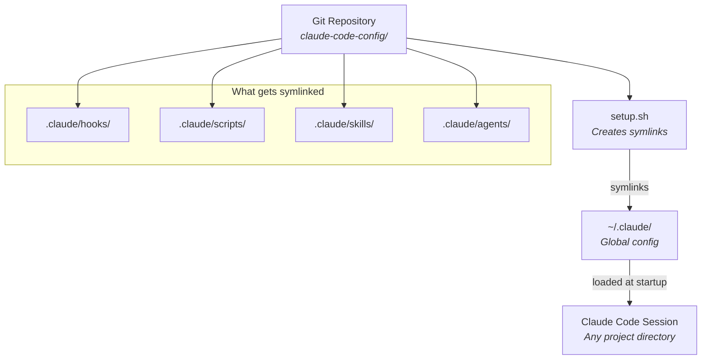
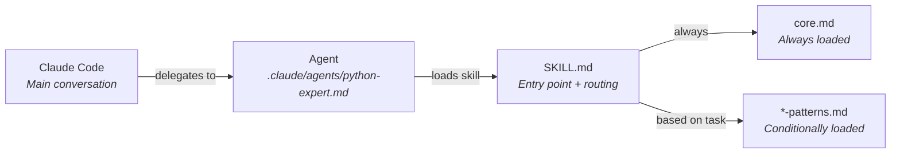
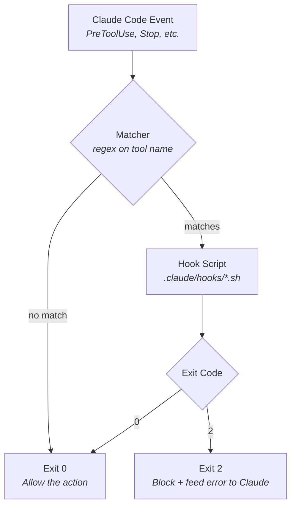
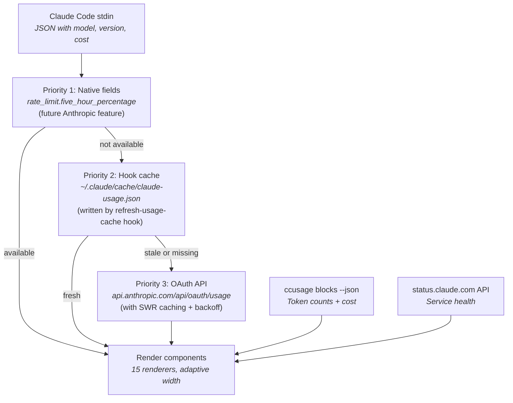

# Architecture

This document explains how the claude-code-config system is designed and why the design choices were made. It covers the symlink architecture, the agent+skill pattern, the hook system, the statusline data pipeline, and the MCP key management system.

## System overview

The core idea is simple: a single Git repository contains all Claude Code configuration. A setup script symlinks the repo's `.claude/` directory into `~/.claude/`, making everything available globally. Pulling updates from Git automatically updates the configuration.

This means no files are copied. The symlinks point back to the Git repo. When you `git pull`, the changes propagate instantly — no reinstallation required.

## The agent + skill pattern

Every domain expert follows the same two-component pattern: an **agent** that defines persona and behavior, and a **skill** that provides the actual knowledge.

### Why separate agents from skills?

The separation serves two purposes:

1. **Context efficiency**: The agent loads `SKILL.md` which contains a conditional loading table. Only the relevant pattern files are loaded based on the task. A Python expert writing async code loads `async-patterns.md` but not `cli-patterns.md`. This preserves context window space.

2. **Reusability**: Multiple agents can load the same skill. The `pr-manager` agent loads both `pr-writing` and `pr-operations` skills. A future `full-stack-expert` could load both `python-standards` and `dotnet-standards`.

### The conditional loading pattern

Every skill follows this structure:

- `SKILL.md`: entry point with frontmatter, persona, conditional loading table, quick reference
- `core.md`: foundational principles that are ALWAYS loaded
- `*-patterns.md`: topic-specific patterns loaded ONLY when relevant
- `references/`: optional deep-dive material (checklists, API design)

The conditional loading table in `SKILL.md` tells the agent which files to read:

| Task Type | Load |
|-----------|------|
| Async code | async-patterns.md |
| Pydantic models | pydantic-patterns.md |
| CLI applications | cli-patterns.md |

This is context engineering — providing the right information at the right time, not everything all at once.

## The hook system

Hooks are standalone bash scripts that run at specific points in Claude Code's lifecycle. Each hook follows the Claude Code hook protocol: receive JSON on stdin, write to stdout/stderr, and return exit codes to control behavior.

Each hook solves a specific problem:

- **enforce-git-pull-rebase**: ensures linear commit history by injecting `--rebase` into all `git pull` commands. The hook rewrites the command and returns it via `updatedInput` JSON.
- **open-file-in-ide**: works around JetBrains bug #3085 where diagnostics timeout if the file is not the active tab. Uses a 3-tier IDE detection system (env var → running process → PATH fallback).
- **rate-limit-brave-search**: enforces per-second rate limiting on Brave Search API calls using a filesystem mutex (`mkdir` atomic lock) and a timestamp file. Prevents quota exhaustion on the free tier.
- **validate-readonly-sql**: blocks destructive SQL operations (INSERT, UPDATE, DELETE, DROP, etc.) in databricks CLI commands. Configured at the agent level (databricks-expert frontmatter), not project level.
- **refresh-usage-cache**: fires a background Haiku API call to cache rate limit utilization data. Runs on every tool call and on agent stop.

## The statusline data pipeline

The statusline renders real-time metrics in Claude Code's status bar. It uses a 3-tier priority chain for usage data, ensuring resilience when any single data source is unavailable.

The OAuth API cache uses production-grade patterns:
- **30-second TTL** for fresh cache
- **Atomic mkdir-based locking** to prevent thundering herd across concurrent sessions
- **Decorrelated jitter backoff** (30s-300s) on API failures
- **Stale-while-error**: serves last known good value when the API is down

The service status cache (status.claude.com) uses a separate SWR pattern: 5-minute fresh TTL, 15-minute max stale, background refresh via disowned subshell.

## MCP key management

The `mcp-key-rotate` script manages pools of API keys for MCP servers. This solves the problem of free-tier quota exhaustion — when one key's credits are used up, rotate to the next.

The system auto-detects the secrets backend:

1. **Doppler** (enterprise): if the Doppler CLI is installed and configured for the project, uses Doppler secrets management.
2. **Envfile** (default): reads/writes API keys from `~/.claude/mcp-keys.env`. After rotation, syncs the active key to the envfile.

Key rotation is atomic: find the current key's index in the pool, advance to the next, and write the new active key. Quota checking calls the provider's API (Brave: response headers, Tavily: `/usage` endpoint) with a 5-minute cache to avoid redundant API calls.

## The setup system

The setup script is modular: `setup.sh` sources 8 modules from `lib/setup/`. Each module handles one concern (TUI widgets, MCP registration, settings manipulation, etc.). This keeps the main script orchestration-only.

The interactive TUI uses raw terminal input (`tui_readkey`) to build arrow-key menus, multi-select checkboxes, and yes/no toggles — all without external dependencies beyond bash. The statusline preview renders a live sample with your chosen settings before confirming.

The setup is idempotent: running it again detects existing symlinks and skips them, updates settings non-destructively (merge mode), and handles repo-move scenarios by detecting changed symlink targets.

## Cross-cutting design principles

- **No hardcoded values**: API keys use `${VAR}` expansion, profile names are discovered at runtime, tool paths use `$CLAUDE_PROJECT_DIR`
- **Graceful degradation**: missing optional tools (fd, fzf, ccusage) are skipped, not required. Stale cache data is served rather than failing.
- **POSIX portability**: all scripts target bash 3.2+ (macOS default). Millisecond timestamps use `python3` instead of GNU-only `date +%s%3N`. Atomic locking uses `mkdir` instead of `flock`.
- **Testability**: BATS test suite (11 files) covers hooks, statusline, proxy, MCP rotation, and setup CLI parsing.

## See also

- [Design Decisions](design-decisions.md): ADRs for each architectural choice (symlinks, agent+skill separation, conditional loading, etc.)
- [Project Structure](project-structure.md): complete file listing with module responsibilities
- [Configuration](configuration.md): full reference for all settings and environment variables
- [Getting Started](getting-started.md): tutorial for first-time setup
